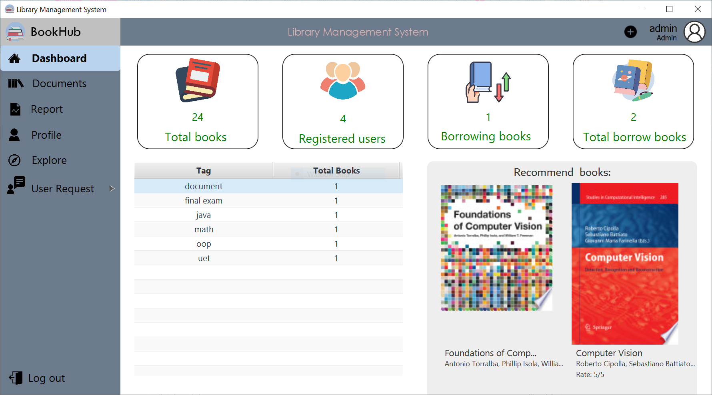

# Library management system 📚

## Setup 🛠

### Prerequisites

- IntelliJ IDEA
- JDK17
- OpenJFX 21
- MySQL

### Step by step

- Clone and open this repository in IntelliJ IDEA
- Config class `DatabaseHelper.java` to your local settings
- Config the project SDK to JDK17 (File -> Project Structure -> Project Settings -> Project)
- Open Maven tool window and run `clean` and `install`
- Open `Run/Debug Configuration` window
- Click New Application and choose JDK17
- Choose `Modify Options` and enable `Add VM Options`
- Config the vm options with this line `--module-path {path to sdk}/javafx-sdk-21.0.4/lib --add-modules javafx.controls,javafx.fxml,javafx.web`
- Save and run AppStart to start using our application

## Preview 👓

## 💗 Special thanks to 💖
* [phandangnhat13](https://github.com/phandangnhat13)
* [minhtruong1411](https://github.com/minhtruong1411)
* [MinhQuanThach](https://github.com/MinhQuanThach)

---
<h1 align="center"> 😴 Made by Culi team ! 🛌</h1>

<i>Dec 2024</i>
